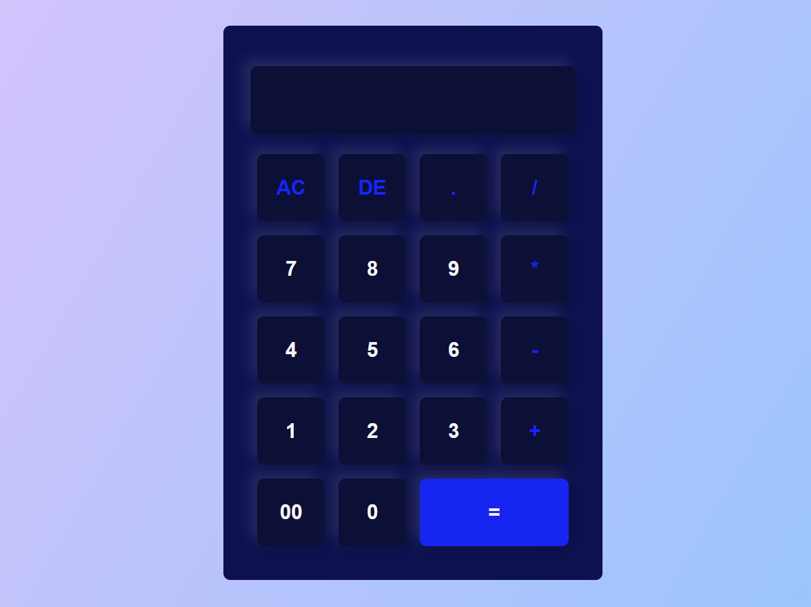

# Calculatrice

Une calculatrice simple en HTML, CSS permettant d'effectuer des opérations de base : addition, soustraction, multiplication et division.

## Fonctionnalités

- **Addition (+)**
- **Soustraction (-)**
- **Multiplication (\*)**
- **Division (/)**
- **AC (All Clear)** : Réinitialise l'affichage
- **DE (Delete)** : Supprime le dernier chiffre saisi

## Technologies utilisées

- **HTML** : Structure de la page
- **CSS** : Design et mise en forme

## Utilisation

1. Saisissez les chiffres et les opérateurs en cliquant sur les boutons.
2. Cliquez sur `=` pour afficher le résultat.
3. Utilisez `AC` pour tout effacer et `DE` pour supprimer le dernier caractère.
